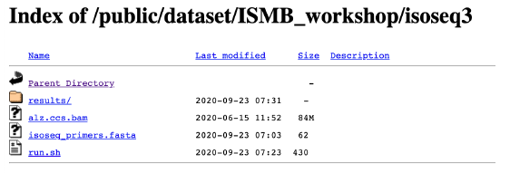

# Using the Iso-Seq Application on SMRTlink and BioConda

Elizabeth Tseng, Principal Scientist, PacBio

## Why use Iso-Seq analysis?

**ISO-SEQ ANALYSIS MAIN FEATURES**
* No reference genome required
* No transcriptome assembly required
* Recovers full-length (5’ to 3’) transcripts
* Yields highly accurate (>99%) transcripts

**HIFI READS FROM CCS**


**FULL-LENGTH READS HAVE 5’ AND 3’ PRIMERS**


**REMOVE CONCATEMERS AND POLY(A) TAILS**


**CLUSTER TO GET ISOFORMS**


* High Quality (HQ):
accuracy ≥99% and ≥2 FLNC read support
* Low Quality (LQ):
accuracy <99% and ≥2 FLNC read support

**MAP AND COLLAPSE ISOFORMS**


**BENEFITS OF ISO-SEQ ANALYSIS APPLICATION**
* High-quality transcripts
* Full-Length Non-concatemer reads
* Mapped & collapsed isoforms
* Removes artifacts
* Removes poly(A) tails

## Iso-Seq Analysis Using pbBioConda

**INSTRUCTIONS TUTORIAL**

Follow the instructions tutorial for installing all the software needed.
* If you do not have an HPC server to install pbbioconda, you should have already:
  - Create an AWS account
  - Create an AWS Linux Instance to run Iso-Seq 3 Analysis Pipeline
  - Connect to your AWS Instance
* Upgrades and Install Software

**DOWNLOAD THE DATA** [here](https://downloads.pacbcloud.com/public/dataset/ISMB_workshop/)



Example:
```
$ wget –nv https://downloads.pacbcloud.com/public/dataset/ISMB_workshop/isoseq3/alz.ccs.bam
```

**SPECIFY ISO-SEQ PRIMERS**
```
$ more primers.fasta
```
<div class="output"> >5p
GCAATGAAGTCGCAGGGTTGGG
</div>
<div class="output"> >3p
GTACTCTGCGTTGATACCACTGCTT
</div>


**INPUT CCS BAM FILE**
```
$ samtools view -h alz.ccs.bam
```
<div class="output">
m141008_060349_42194_c100704972550000001823137703241586_s1_p0/63/ccs4*0255
**00CCCGGGGATCCTCTAGAATGC~~~~~~~~~~~~~~~~~~~~~RG:Z:83ba013f np:i:35
rq:f:0.999682 sn:B:f,11.3175,6.64119,11.6261,14.5199 zm:i:63
</div>

**REFERENCE GENOME**
```
$ grep '>’ hg38.fa # to list the headers per chromosome
```
<div class="output">

>chr1 AC:CM000663.2 gi:568336023 LN:248956422 rl:Chromosome M5:6aef897c3d6ff0c78aff06ac189178dd AS:GRCh38

>chr2 AC:CM000664.2 gi:568336022 LN:242193529 rl:Chromosome M5:f98db672eb0993dcfdabafe2a882905c AS:GRCh38

>chr3 AC:CM000665.2 gi:568336021 LN:198295559 rl:Chromosome M5:76635a41ea913a405ded820447d067b0 AS:GRCh38

>chr4 AC:CM000666.2 gi:568336020 LN:190214555 rl:Chromosome M5:3210fecf1eb92d5489da4346b3fddc6e AS:GRCh38

>chr5 AC:CM000667.2 gi:568336019 LN:181538259 rl:Chromosome M5:a811b3dc9fe66af729dc0dddf7fa4f13 AS:GRCh38 hm:47309185-49591369
…

</div>


**SOFTWARE INSTALLATION CHECK**

Access to your conda environment
```
$ source activate <name of your environment>
```

Check your installation
```
$ isoseq3 --version
```
<div class="output">
isoseq3 3.4.x
</div>
```
$ lima --version
```
<div class="output">
lima 1.11.0
</div>
```
$ pbmm2 –-version
```
<div class="output">
pbmm2 1.3.0
</div>
