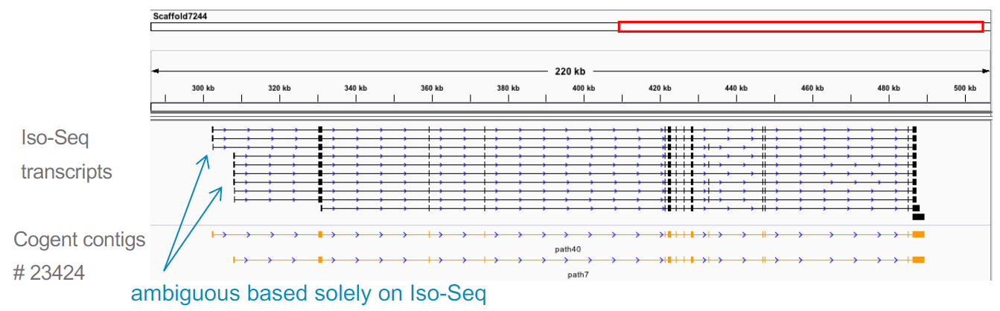

# IsoPhase: Isoform-Level Phasing

Elizabeth Tseng, Principal Scientist, PacBio

**ISOFORM-LEVEL PHASING USING ISO-SEQ READS**

**ISOPHASE: ISOFORM-LEVEL PHASING**

**MATERNAL IMPRINTING IN MAIZE**

**PARENTAL-SPECIFIC ISOFORM EXPRESSION IN MAIZE**

**PHASING BEYOND DIPLOID – A CHALLENGE**

**TISSUE-SPECIFIC ALLELIC EXPRESSION IN CATTLE**

**ISOPHASE ON GITHUB (PART OF CUPCAKE)**

https://github.com/Magdoll/cDNA_Cupcake/wiki/IsoPhase:-Haplotyping-using-Iso-Seq-data

## Cogent: Coding Genome Reconstruction Without A Reference Genome

**NO GENOME? NO PROBLEM**

COGENT workflow
* Using only Iso-Seq data to find gene families and reconstruct a fake “genome”

https://github.com/Magdoll/Cogent

Use COGENT results to…
* Evaluate genome assemblies
  * Pig Iso-Seq Cogent rescued 5 missing genes for
the new pig assembly

* Visualize alternative splicing
  * You can still see skipped exons!

**COGENT: WHY?**

Not every species has a high-quality reference genome
* If genome is poor, genome annotation (ab initio prediction & mapping) will suffer

Iso-Seq bioinformatics does not require a genome
* There is often enough information in Iso-Seq transcripts itself to identify gene families and the “coding” regions of the genome

**COGENT: HOW**

**COGENT: GENE FAMILY FINDING**

**GENE FAMILY PARTITIONING OF 9 HUMAN GENES**

**COGENT: GENOME RECONSTRUCTION**

Full Cogent algorithm [here](https://github.com/Magdoll/Cogent)

**COGENT CASE STUDY: PIG GENOME EVALUATION**

**COGENT CASE STUDY: MAKING A “FAKE CODING” GENOME**

Click [here](https://github.com/Magdoll/Cogent/wiki/Tutorial%3A-Using-Cogent-to-collapse-redundant-transcripts-in-absence-of-genome) for the tutorial

Genome-based View
* All introns are visible

Cogent-based View
* Introns that are never transcribed are not visible

**WHY COGENT MAY SOMETIMES OUTPUT >1 CONTIGS**

- Lack of connectivity information between exon 1 and 2 based solely on transcripts
- Cogent outputs two contigs, one with exon 1 - 3, one with exon 2 – 3
- Mapping back to genome shows that the reconstruction is correct
- This is a case where genome information can be used to order exon 1 and 2

_Coming soon: Special Cogent parameter to make “best guess” for ambiguity_

The pdf to this documentation can be found [here](https://raw.githubusercontent.com/ucdavis-bioinformatics-training/ucdavis-bioinformatics-training.presentations/master/isoseq/liz/5-Liz-IsoPhase%20and%20Cogent.pdf)
