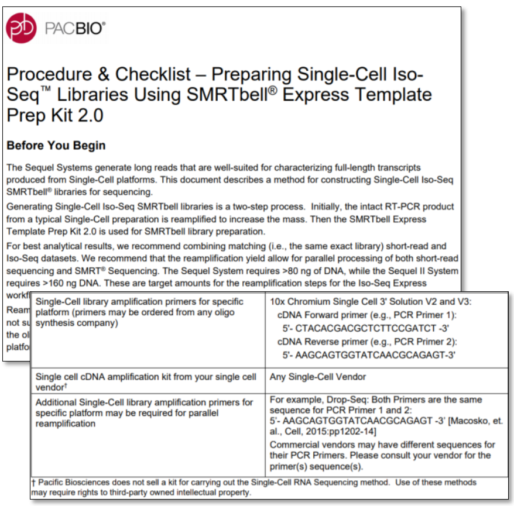
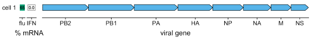
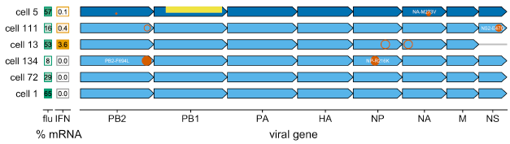
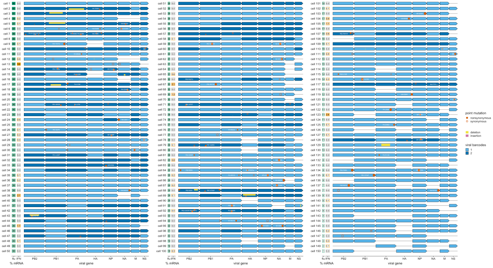

# Single-Cell RNA Sequencing using the Iso-Seq Method

Elizabeth Tseng, Principal Scientist, PacBio

**SINGLE-CELL ISO-SEQ METHOD: WHY?**

**PACBIO HIFI READS ARE ACCURATE FOR SINGLE-CELL**

**COMPATIBLE WITH FULL-LENGTH SINGLE-CELL PLATFORMS**

**SINGLE-CELL ISO-SEQ WORKFLOW**
- Compatible with any full-length single-cell platform
- Detailed workflow guidance
- Standard Iso-Seq library preparation & sequencing
workflow
- Can generate matching short read data from same
sample
- ~3 million HiFi reads per SMRT Cell 8M
- Flexible barcoding & multiplexing based on desired
number of reads per cell

## Single-Cell Iso-Seq Research Highlights

**SINGLE-CELL ISO-SEQ METHOD ON DIFFERENT PLATFORMS**

**COMBINING SHORT- AND LONG-READ SINGLE CELL DATA**

- Short read data identifies cell clusters
- Long read data identifies full-length isoforms
- Matching (UMI, BC) links isoforms to cell types

Click [here](https://www.biorxiv.org/content/10.1101/2020.08.27.268730v1.full.pdf) for more information

**CHIMP-HUMAN TSS DIFFERENCE IN SINGLE-CELL ORGANOIDS**

Click this [Youtube video](https://www.youtube.com/watch?v=XKIT0Tw664s) if you want to know more

**AGED MICE SHOW MORE DIVERSE V(D)J RECOMBINATION**

**CONCATENATION OF SINGLE-CELL TRANSCRIPTS**

Click [here](https://medium.com/@magdoll) for the article

**Human influenza infections are initiated by just a few virions**

Click [here](https://www.ncbi.nlm.nih.gov/pmc/articles/PMC5933925/) and [here](https://jvi.asm.org/content/93/14/e00500-19) for the articles

1. We take many cells, and infect them with many virions
2. We usually average over this entire process to study infection
3. We infect A549 cells at low multiplicity of infection (MOI)
4. This yields a large cell-gene matrix that we cananalyze computationally

  - Extreme variation across single cells

  

5. I said that we used a stock of "wildtype” virus. Actually, all viral stocks contain mutants. Maybe mutations in the virions explain
variation across cells…
  - Single-cell transcriptomics counts mRNAs, it doesn’t tell us if they have mutations

  

6. We start with the same process as for single-cell transcriptomics. But we also perform full-length PacBio sequencing on viral genes

  - Cells infected by wildtype virions often produce lots of viral mRNA

  

  - Although some wildtype virions produce less viral mRNA than others

  

  - Virions with mutations sometimes produce little viral mRNA

  

  - Virions with defects sometimes produce IFN: fails to express NS

  

  - Virions with defects sometimes produce IFN: point mutation in NS

  

  - Virions with defects sometimes produce IFN: internal deletion in PB1

  

  - Virions with defects sometimes produce IFN: point mutation in PB1

  

  - But even virions lacking NS do not always induce IFN

  

  - And sometimes wildtype virions induce IFN

  

  - 150 cells infected, only 49 by wildtype virions

  

  - Infections by wildtype virions are less heterogeneous than ones by mutant ones

  

  - Infections by mutant virions induce more IFN

  

**SINGLE-CELL VIRAL SEQUENCING**

* Single-cell sequencing of H1N1 influenza
* Full-length viral transcripts reveal cell-to-cell variation on mutational landscape
* 10hr post-infection, only 49 of 150 infected cells remain wild type
* Mutations linked to differences in viral load and the
innate immune response

## Single-Cell Iso-Seq Bioinformatics

**SINGLE-CELL ISO-SEQ BIOINFORMATICS WORKFLOW**

1. HiFi reads

2. Remove cDNA primers

3. Extract UMI and BC

4. Cluster by (UMI,BC) (Click [here](https://github.com/PacificBiosciences/IsoSeq/blob/master/isoseq-deduplication.md) for the GitHub page)

5. Classify Transcripts

6. Remove Artifacts (Click [here](https://github.com/Magdoll/cDNA_Cupcake/wiki/Iso-Seq-Single-Cell-Analysis:-Recommended-Analysis-Guidelines) for the GitHub page, and [here](https://github.com/ConesaLab/SQANTI3) for more about SQUANTI3)

**TRANSCRIPT CLASSIFICATION BY SQANTI**

**SQANTI3: BEFORE AND AFTER FILTERING**

- After SQANTI3 filtering, percentage of FSMs increase
- Most filtered transcripts are genic, genomic, or intergenic

**SINGLE-CELL ISO-SEQ BIOINFORMATICS WORKFLOW**

Click [here](https://github.com/Magdoll/cDNA_Cupcake/wiki/Iso-Seq-Single-Cell-Analysis:-Recommended-Analysis-Guidelines) to get more information about how this data was generated

The pdf to this documentation can be found [here](https://raw.githubusercontent.com/ucdavis-bioinformatics-training/ucdavis-bioinformatics-training.presentations/master/isoseq/liz/6-Liz-Single%20Cell.pdf)

# Special Iso-Seq topic: Single Cell Iso-Seq (hands on)

The Iso Seq Bioinformatics Tutorial we are using is [here](https://github.com/Magdoll/cDNA_Cupcake/wiki/Iso-Seq-Bioinformatics-Tutorial). See '4. Single Cell' and answer the corresponding practice questions!
